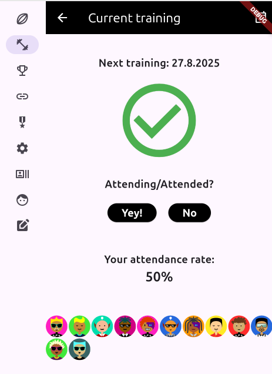
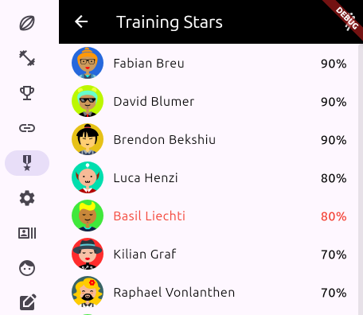

# Waatea 2

An availability and team management tool for rugby teams.  

See [https://www.waatea.vip](https://www.waatea.vip) in action.  

---

## Features

### Player availability
Players can set their availability for each date (**Yes / No / Maybe**).  

### Training attendance
Players can record their training attendance.  

### Game day management
- Coaches can view current availabilities for each game  
- Detail view with all players and their status  
- Line-up editor  
- Line-up publishing and export functions  

### Rankings
Track training attendance, caps, and fitness challenges.  

### Training administration
- Simple training plans with copy function  
- Overview of expected attendance numbers  
- Coaches can edit attended players  

### Player administration
- Manage player positions  
- Classify players by category  

---

## Technology
- **Server:** Django REST Framework  
- **Client:** Flutter app  

---

## Interested?
Contact us for further information.  

